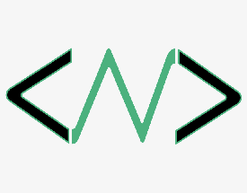

# Capstone_project_1
First Microverse capstone project (module 1-block 5)

  
   

  <h3><b>Capstone Project 1 README</b></h3>

# 📗 Table of Contents

- [📖 About the Project](#about-project)
  - [🛠 Built With](#built-with)
- [💻 Getting Started](#getting-started)
  - [Deployment]
- [👥 Authors](#authors)
- [🔭 Future Features](#future-features)
- [🤝 Contributing](#contributing)
- [⭐️ Show your support](#support)
- [🙏 Acknowledgements](#acknowledgements)
- [📝 License](#license)

# 📖 Capstone Project 1 

**Capstone Project 1** is a project that showcases my abilities to build a website with HTML, CSS and JS

## 🛠 Built With 

- HTML
- BOOTSTRAP
- CSS
- JS

### Key Features 

- **Web page with previews of my projects**

(<a href="#readme-top">back to top</a>)

## 💻 Getting Started 

The user will be able to see the projects I have created and collaborated in through-out my career as a web developer.

To get a local copy up and running, follow these steps.

(<a href="#readme-top">back to top</a>)

You can view this project live using: https://github.com/cnualartc/Capstone_project_1
Project presentation: https://www.loom.com/share/8fc6adf91ba74a2eb8602840b8fa6b53

## 👥 Authors 

👤 **Christian Nualart**

- GitHub: [@githubhandle](https://github.com/cnualartc)
- Twitter: [@twitterhandle](https://twitter.com/Nualart)
- LinkedIn: [LinkedIn](https://linkedin.com/in/cnualart)

(<a href="#readme-top">back to top</a>)

## 🔭 Future Features 

<!-- - [Setup project repo] **[new_feature_1]**
- [Create header and headline] **[new_feature_2]**
- [style header and headline] **[new_feature_3]** -->

(<a href="#readme-top">back to top</a>)

## 🤝 Contributing 

Contributions, issues, and feature requests are welcome!

Feel free to check the issues page. https://github.com/cnualartc/Capstone_project_1/issues

## ⭐️ Show your support 

If you like this project please follow me on github and contribute to the projects you are interested in.

(<a href="#readme-top">back to top</a>)

## 🙏 Acknowledgments 

Special thanks to Cindy Shin, creator of the original design.

(<a href="#readme-top">back to top</a>)

## 📝 License 

This project is [MIT](./LICENSE) licensed.

(<a href="#readme-top">back to top</a>)

